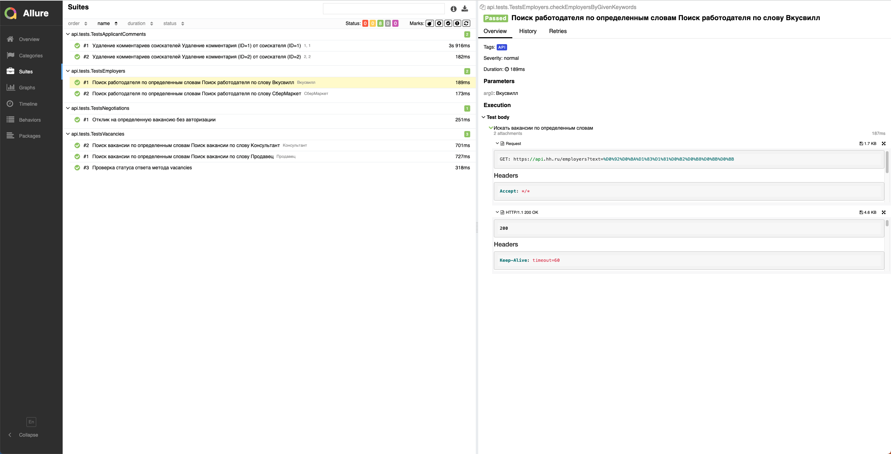
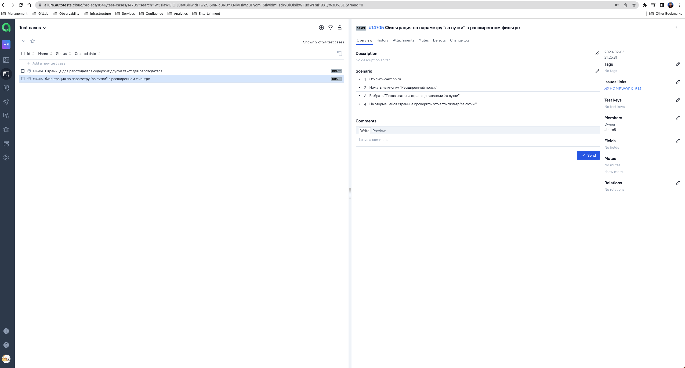
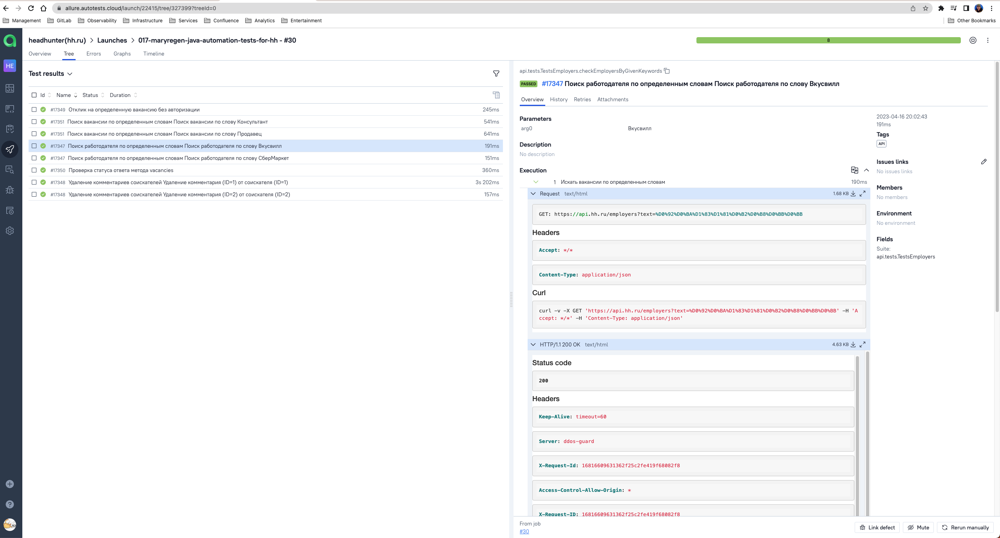
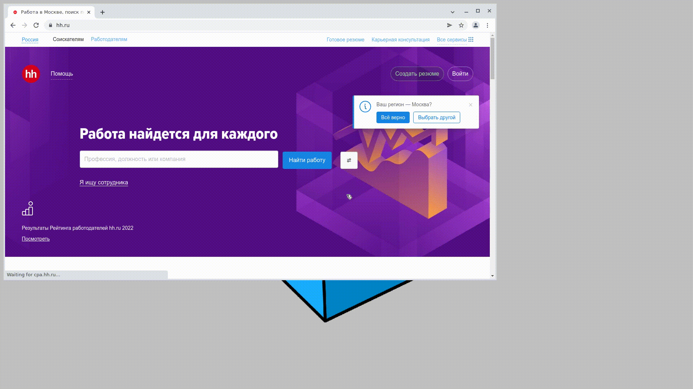
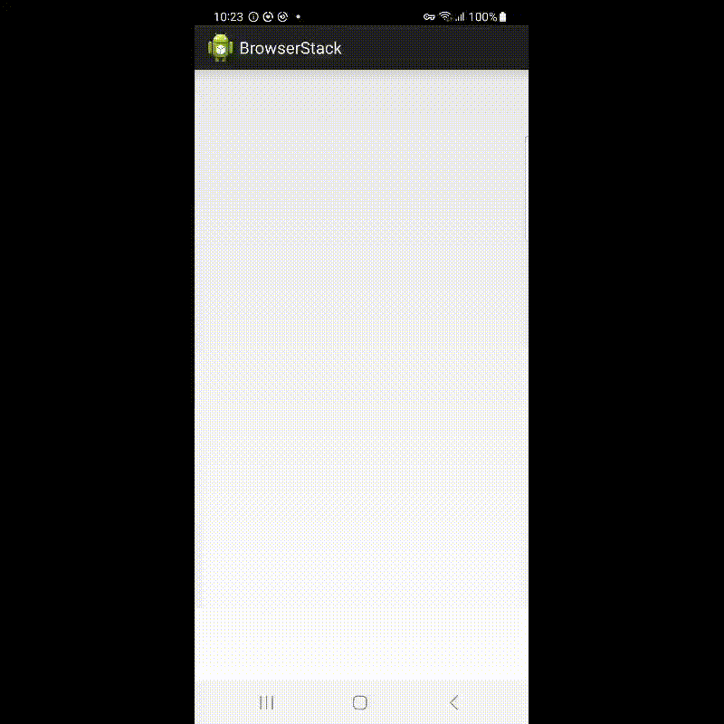

<h1 >Проект по автоматизации тестирования для <a href="https://hh.ru/">HeadHunter</a></h1>

## Содержание

* <a href="#description">Описание</a>
* <a href="#tools">Технологии и инструменты</a>
* <a href="#cases">Реализованные проверки</a>
* <a href="#console">Запуск тестов из терминала</a>
* <a href="#jenkins">Запуск тестов в Jenkins</a>
* <a href="#allure">Отчеты в Allure</a>
* <a href="#testops">Интеграция с Allure TestOps</a>
* <a href="#testops">Интеграция с Jira</a>
* <a href="#telegram">Уведомления в Telegram с использованием бота</a>
* <a href="#selenoidvideo">Пример прогона теста в Selenoid</a>
* <a href="#browserstackvideo">Пример прогона теста в Browserstack</a>

<a id="description"></a>

## Описание

Данный проект состоит из автоматизированных:

* UI-тестов для веб-приложения [hh.ru](https://hh.ru/)
* тестов для [API-части](https://github.com/hhru/api)
* мобильных тестов приложения для Android

<a id="tools"></a>

## Технологии и инструменты

<p align="center">


</p>

Автотесты написаны на <code>Java</code> с использованием <code>JUnit 5</code> и <code>Gradle</code>, применены различные
библиотеки и фреймворки.

Также реализована сборка в <code>Jenkins</code> с формированием Allure-отчета и отправкой уведомления с результатами
в <code>Telegram</code> после завершения прогона.
В качестве системы управления тестированием выбран <code>Allure TestOps</code>.

Allure-отчет включает в себя:

* шаги выполнения тестов;
* скриншот страницы в браузере в момент окончания автотеста;
* Page Source;
* логи браузерной консоли;
* видео выполнения автотеста.

### Для UI-тестов

* при написании использован фреймворк [Selenide](https://selenide.org/)
* запуск осуществляется локально или с помощью [Selenoid](https://aerokube.com/selenoid/).

### Для API-тестов

* при написании использована библиотека [REST Assured](https://rest-assured.io)
* для сокращения шаблонного кода применена библиотека [Lombok](https://projectlombok.org/)

### Для mobile-тестов

* при написании использован фреймворк с открытым исходным кодом [Appium](https://appium.io)
* для просмотра и взаимодействия с элементами интерфейса
  выбран [Appium Inspector](https://github.com/appium/appium-inspector)
* запуск может осуществляться локально в эмуляторе [Android Studio](https://developer.android.com/studio)
* удаленный запуск осуществляется с помощью фермы реальных мобильных
  устройств [Browserstack](https://app-automate.browserstack.com/)

<a id="cases"></a>

## Реализованные проверки

### Автоматизированные проверки UI

- [ ] Проверка смены языка на английский
- [ ] Проверка смены региона
- [ ] Проверка текста для работодателя
- [ ] Проверка текста для соискателя
- [ ] Поиск вакансий по профессии для соискателя
- [ ] Поиск вакансий по компании для соискателя
- [ ] Поиск вакансий по должности в каталоге для соискателя

### Мануальные проверки

- [ ] Фильтрация по параметру "за сутки" в расширенном фильтре
- [ ] Страница для работодателя содержит другой текст для работодателя

### Автоматизированные проверки API

- [ ] Проверка статуса ответа метода vacancies
- [ ] Поиск работодателя по определенным словам (параметризация ВкусВилл/СберМаркет)
- [ ] Поиск вакансии по определенным словам (параметризация Продавец/Консультант)
- [ ] Отклик на определенную вакансию без авторизации
- [ ] Удаление комментариев соискателей

### Автоматизированные проверки MOBILE APP

- [ ] Проверка заголовка главной страницы с вакансиями
- [ ] Поиск вакансий по заданному параметру
- [ ] Вакансия содержит кнопку 'Откликнуться'

<a id="console"></a>

## Запуск тестов

### Локальный запуск тестов

#### Для UI-тестов

```
./gradlew clean ui_tests -Denv=local
```

#### Для API-тестов

```
./gradlew clean api_tests 
```

#### Для MOBILE-тестов

```
./gradlew clean mobile_tests -DdeviceHost=emulator
```

### Удаленный запуск тестов

Выбираем опции Gradle в зависимости от типа запускаемых тестов:

* UI-тесты запускаем `BROWSER`, `BROWSER_SIZE`, `REMOTE_URL`
* API-тесты запускаем без параметризации
* Mobile-тесты запускаем с `deviceHost` (`browserstack`)

```
bash run.sh [api_tests|ui_tests|mobile_tests]
```

Для запуска тестов локально или удалённо, требуется указать вид теста первым параметром. Далее, с помощью переменных
окружения (см. ниже), сконфигурировать запуск тестов.

> `${BROWSER}` - комбинация браузера и версии (_по умолчанию - <code>chrome 100.0</code>_).
>
> `${BROWSER_SIZE}` - размер окна браузера (_по умолчанию - <code>1366x768</code>_).
>
> `${REMOTE_URL}` - адрес удаленного сервера, на котором будут запускаться тесты.

Например, для запуска API-тестов:

```
bash run.sh api_tests
```

Для запуска UI-тестов локально:

```
BROWSER="chrome 112.0" BROWSER_SIZE="1920x1080" bash run.sh ui_tests
```

Для запуска UI-тестов удалённо:

```
BROWSER="chrome 112.0" BROWSER_SIZE="1920x1080" REMOTE_URL="http://selenium.webdriver.tld:4444/wd/hub" bash run.sh ui_tests
```

> > > > > > > 9344233 (Added run.sh instruction)

<a id="jenkins"></a>

## Запуск тестов в [Jenkins](https://jenkins.autotests.cloud/job/017-maryregen-java-automation-tests-for-hh/)

1. Для запуска сборки необходимо перейти в раздел **Собрать с параметрами**
2. Запуская ui-тесты, необходимо указать параметры для сборки (путем выбора из списка или прямым указанием значения) и
   в <code>TEST_TYPE</code> выбрать ui-tests.
3. Запуская api-тесты или mobile-тесты, можно оставить все предзаполненные поля, поменяв <code>TEST_TYPE</code>
   соответственно на api_tests или mobile_tests.
4. Нажать кнопку **Собрать**.

<p align="center">
</a>
</p>

<a id="allure"></a>

## Отчеты в [Allure Report](https://jenkins.autotests.cloud/job/017-maryregen-java-automation-tests-for-hh/16/allure/)

### Прохождение UI-тестов

<p align="center">

</p>

### Прохождение API-тестов

<p align="center">

</p>

### Прохождение mobile-тестов

<p align="center">

</p>

<a id="testops"></a>

## Интеграция с [Allure TestOps](https://allure.autotests.cloud/project/1846/dashboards)

### Прохождение UI-тестов

<p align="center">

</p>

### Прохождение API-тестов

<p align="center">

</p>

### Прохождение mobile-тестов

<p align="center">

</p>

### Пример мануального тест-кейса

<p align="center">

</p>

### Пример запуска тест-кейсов

<p align="center">

</p>

<a id="jira"></a>

## Интеграция с [Jira](https://jira.autotests.cloud/browse/HOMEWORK-514)

<p align="center">

</p>

<a id="telegram"></a>

## Уведомления в Telegram с использованием бота

### Уведомление о прохождении UI-тестов

<p align="center">

</p>

### Уведомление о прохождении API-тестов

<p align="center">

</p>

### Уведомление о прохождении mobile-тестов

<p align="center">

</p>

<a id="selenoidvideo"></a>

## Пример прогона UI-теста в Selenoid

К каждому тесту в отчете прилагается видео.
<p align="center">
  
</p>

<a id="browserstackvideo"></a>

## Пример прогона mobile-теста в Browserstack

К каждому тесту в отчете прилагается видео.
<p align="center">
  
</p>