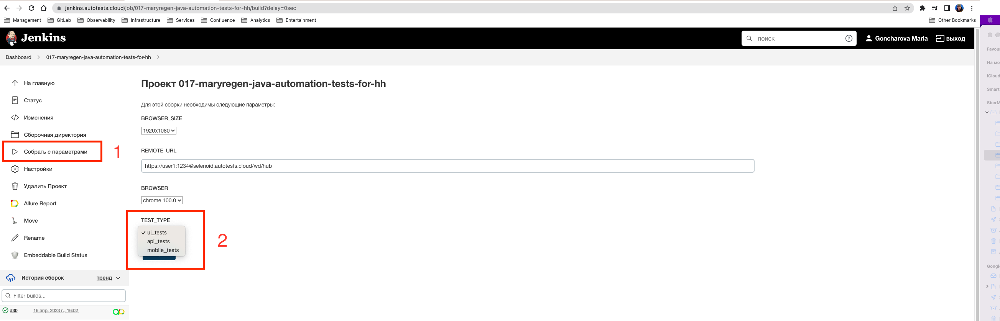

<h1 >Проект по автоматизации тестирования для <a href="https://hh.ru/ ">HeadHunter</a></h1>

## Содержание

* <a href="#tools">Технологии и инструменты</a>
* <a href="#cases">Реализованные проверки</a>
* <a href="#console">Запуск тестов из терминала</a>
* <a href="#jenkins">Запуск тестов в Jenkins</a>r
* <a href="#allure">Отчеты в Allure</a>
* <a href="#testops">Интеграция с Allure TestOps</a>
* <a href="#testops">Интеграция с Jira</a>
* <a href="#telegram">Уведомления в Telegram с использованием бота</a>
* <a href="#selenoidvideo">Пример прогона теста в Selenoid</a>
* <a href="#browserstackvideo">Пример прогона теста в Browserstack</a>

<a id="tools"></a>
## Технологии и инструменты

<p align="center">


</p>
Данный проект состоит из автоматизированных UI-тестов, тестов API и мобильных тестов android-приложения для продукта HeadHunter. 

Автотесты написаны на <code>Java</code> с использованием <code>JUnit 5</code> и <code>Gradle</code>, применены различные библиотеки и фреймворки. 

Также реализована сборка в <code>Jenkins</code> с формированием Allure-отчета и отправкой уведомления с результатами в <code>Telegram</code> после завершения прогона. 
В качестве системы управления тестированием выбран <code>Allure TestOps</code>. 

Allure-отчет включает в себя:
* шаги выполнения тестов;
* скриншот страницы в браузере в момент окончания автотеста;
* Page Source;
* логи браузерной консоли;
* видео выполнения автотеста.

### Для UI-тестов
* при написании использован фреймворк [Selenide](https://selenide.org/)
* запуск осуществляется локально или с помощью [Selenoid](https://aerokube.com/selenoid/).

### Для API-тестов 
* при написании использована библиотека [REST Assured](https://rest-assured.io)
* для сокращения шаблонного кода применена библиотека [Lombok](https://projectlombok.org/)

### Для mobile-тестов 
* при написании использован фреймворк с открытым исходным кодом [Appium](https://appium.io) 
* для просмотра и взаимодействия с элементами интерфейса выбран [Appium Inspector](https://github.com/appium/appium-inspector) 
* запуск может осуществляться локально в эмуляторе [Android Studio](https://developer.android.com/studio)
* удаленный запуск осуществляется с помощью фермы реальных мобильных устройств [Browserstack](https://app-automate.browserstack.com/)

<a id="cases"></a>
## Реализованные проверки

### Автоматизированные проверки UI
- [ ] Страница для работодателя содержит текст для работодателя
- [ ] Страница для соискателя содержит текст для соискателя
- [ ] При смене языка на "англйиский" текст на страницу меняет язык 
- [ ] При поиске конкретных вакансий в выдаче показываются только нужные результаты 
- [ ] При смене города в выдаче показываются только вакансии в данном городе
- [ ] 
- [ ]

### Мануальные проверки 
- [ ] Фильтрация по параметру "за сутки" в расширенном фильтре 
- [ ] Страница для работодателя содержит другой текст для работодателя

### Автоматизированные проверки API
- [ ] Проверка статуса ответа метода vacancies
- [ ] Поиск вакансии по определенным словам
- [ ] 403 Forbidden при отклике на определенную вакансию без авторизации
- [ ]
- [ ]

### Автоматизированные проверки MOBILE APP 
- [ ] Проверка заголовка главной страницы с вакансиями
- [ ] Поиск вакансий по заданному параметру
- [ ] Вакансия содержит кнопку 'Откликнуться'

<a id="console"></a>
##  Запуск тестов
### Локальный запуск тестов 
#### Для UI-тестов
```
gradle clean ui_tests -Denv=local
```
#### Для API-тестов
```
gradle clean api_tests 
```
#### Для MOBILE-тестов
```
gradle clean mobile_tests -DdeviceHost=emulator
```

### Удаленный запуск тестов

```
export BROWSER_PLATFORM=$(echo "${BROWSER}" | awk '{print $1}')
export BROWSER_VERSION=$(echo "${BROWSER}" | awk '{print $2}')

./gradlew clean ${TEST_TYPE}
if ${TEST_TYPE}=ui_tests then
  -Dbrowser=${BROWSER_PLATFORM} \
  -Dversion=${BROWSER_VERSION} \
  -DwindowSize=${BROWSER_SIZE} \
  -DremoteUrl=${REMOTE_URL}
```

> `${BROWSER}` - комбинация браузера и версии (_по умолчанию - <code>chrome 100.0</code>_).
>
> `${BROWSER_PLATFORM}` - наименование браузера (_по умолчанию - <code>chrome</code>_).
> 
> `${BROWSER_VERSION}` - номер версии браузера (_по умолчанию - <code>100.0</code>_).
> 
> `${BROWSER_SIZE}` - размер окна браузера (_по умолчанию - <code>1366x768</code>_).
>
> `${REMOTE_URL}` - адрес удаленного сервера, на котором будут запускаться тесты.
> 
> `${TEST_TYPE}` - тип запускаемых тестов (ui_tests, api_tests, mobile_tests).

<a id="jenkins"></a>
## Запуск тестов в [Jenkins](https://jenkins.autotests.cloud/job/017-maryregen-java-automation-tests-for-hh/)

> Для запуска сборки необходимо перейти в раздел Собрать с параметрами и нажать кнопку Собрать. 
> Сборка с параметрами позволяет перед запуском изменить параметры для сборки (путем выбора из списка или прямым указанием значения).

<p align="center">
</a>
</p>

<a id="allure"></a>
## Отчеты в [Allure Report](https://jenkins.autotests.cloud/job/017-maryregen-java-automation-tests-for-hh/16/allure/)

### Основное окно

<p align="center">

</p>

### Тесты

<p align="center">

</p>

<a id="testops"></a>
## Интеграция с [Allure TestOps](https://allure.autotests.cloud/project/1846/dashboards) 

### Тест-кейсы
<p align="center">

</p>

### Пример мануального тест-кейса
<p align="center">

</p>

### Пример запуска тест-кейсов
<p align="center">

</p>

<a id="jira"></a>
## Интеграция с [Jira](https://jira.autotests.cloud/browse/HOMEWORK-514) 
<p align="center">

</p>

<a id="telegram"></a>
## Уведомления в Telegram с использованием бота

<p>

</p>

<a id="selenoidvideo"></a>
## Пример прогона UI-теста в Selenoid

> К каждому тесту в отчете прилагается видео
<p align="center">
  
</p>

<a id="browserstackvideo"></a>
## Пример прогона mobile-теста в Browserstack

> К каждому тесту в отчете прилагается видео
<p align="center">
  
</p>