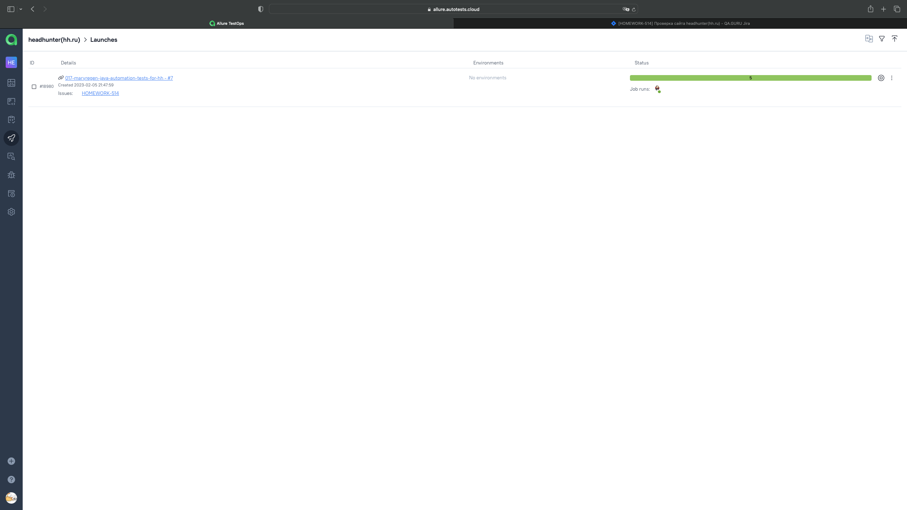

<h1 >Проект автоматизации UI для сайта <a href="https://hh.ru/ ">hh.ru</a></h1>

## Содержание

* <a href="#tools">Технологии и инструменты</a>
* <a href="#cases">Реализованные проверки</a>
* <a href="#console">Запуск тестов из терминала</a>
* <a href="#jenkins">Запуск тестов в Jenkins</a>
* <a href="#allure">Отчеты в Allure</a>
* <a href="#testops">Интеграция с Allure TestOps</a>
* <a href="#testops">Интеграция с Jira</a>
* <a href="#telegram">Уведомления в Telegram с использованием бота</a>
* <a href="#video">Пример прогона теста в Selenoid</a>

<a id="tools"></a>
## Технологии и инструменты

<p align="center">


</p>

Автотесты написаны на <code>Java</code> с использованием <code>JUnit 5</code> и <code>Gradle</code>.
Для UI-тестов использован фреймворк [Selenide](https://selenide.org/).
Запуск тестов можно осуществлять локально или с помощью [Selenoid](https://aerokube.com/selenoid/).
Также реализована сборка в <code>Jenkins</code> с формированием Allure-отчета и отправкой уведомления с результатами в <code>Telegram</code> после завершения прогона.

Allure-отчет включает в себя:
* шаги выполнения тестов;
* скриншот страницы в браузере в момент окончания автотеста;
* Page Source;
* логи браузерной консоли;
* видео выполнения автотеста.

<a id="cases"></a>
## Реализованные проверки

### Автоматизированные проверки
- [ ] Страница для работодателя содержит текст для работодателя
- [ ] Страница для соискателя содержит текст для соискателя
- [ ] При смене языка на "англйиский" текст на страницу меняет язык 
- [ ] При поиске конкретных вакансий в выдаче показываются только нужные результаты 
- [ ] При смене города в выдаче показываются только вакансии в данном городе

### Мануальные проверки
- [ ] Фильтрация по параметру "за сутки" в расширенном фильтре 
- [ ] Страница для работодателя содержит другой текст для работодателя

<a id="console"></a>
##  Запуск тестов из терминала
### Локальный запуск тестов

```
gradle clean run_tests 
```

### Удаленный запуск тестов

```
export BROWSER_PLATFORM=$(echo "${BROWSER}" | awk '{print $1}')
export BROWSER_VERSION=$(echo "${BROWSER}" | awk '{print $2}')

./gradlew clean run_tests \
  -Dbrowser=${BROWSER_PLATFORM} \
  -Dversion=${BROWSER_VERSION} \
  -DwindowSize=${BROWSER_SIZE} \
  -DbaseUrl=${BASE_URL}
```

> `${BROWSER}` - комбинация браузера и версии (_по умолчанию - <code>chrome 100.0</code>_).
>
> `${BROWSER_PLATFORM}` - наименование браузера (_по умолчанию - <code>chrome</code>_).
> 
> `${BROWSER_VERSION}` - номер версии браузера (_по умолчанию - <code>100.0</code>_).
> 
> `${BROWSER_SIZE}` - размер окна браузера (_по умолчанию - <code>1920x1080</code>_).
>
> `${BASE_URL}` - адрес удаленного сервера, на котором будут запускаться тесты.

<a id="jenkins"></a>
## Запуск тестов в Jenkins

> Сборка с параметрами позволяет перед запуском изменить параметры для сборки (путем выбора из списка или прямым указанием значения).

<p align="center">
</a>
</p>

<a id="allure"></a>
## Отчеты в Allure

### Основное окно

<p align="center">

</p>

### Тесты

<p align="center">

</p>

<a id="testops"></a>
## Интеграция с Allure TestOps 

### Тест-кейсы
<p align="center">

</p>

### Мануальные тест-кейсы
<p align="center">

</p>

### Запуски тест-кейсов
<p align="center">

</p>

<a id="jira"></a>
## Интеграция с Jira 
<p align="center">

</p>

<a id="telegram"></a>
## Уведомления в Telegram с использованием бота

<p align="center">

</p>

<a id="video"></a>
## Пример прогона теста в Selenoid

> К каждому тесту в отчете прилагается видео
<p align="center">
  
</p>